# EDA Insights

Key findings from `nordhome_eda.ipynb`. Fill in after running the notebook.

---

## 1. Revenue

### Q1: How has gross revenue trended month by month over time, and what is total revenue across the full period?

**Insight:** Gross and net revenue move closely together month over month, with an average refund deduction rate of only 2.4% — refunds consistently reduce revenue, but the gap is small relative to overall monthly fluctuations. Over the full period (Jan 2021 – Jun 2024), total gross revenue is €24.83M and financial net revenue is €24.24M. Net revenue reached its lowest point in February 2024, before recovering to approximately €0.66M in June 2024. No major structural breaks or prolonged declines are visible in the monthly trend.

**Chart:** 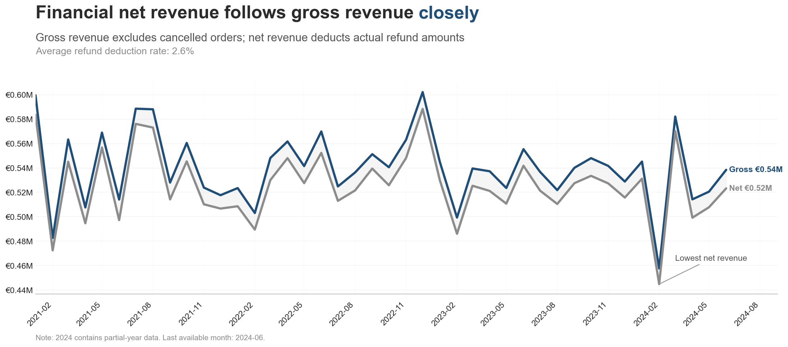

**Business interpretation:** Refunds do not appear to be the main driver of month-to-month revenue volatility — the larger swings are more likely driven by sales volume, seasonality, promotions, or shifts in product and channel performance.

**Limitation:** The 2024 data only covers January through June, so it should not yet be compared directly with complete prior years.

**Further investigation:** Break down the strongest peaks and declines by product category, market, channel, and order volume, and check whether the 2.4% deduction rate stays stable across these segments.

---

### Q2: Which countries and sales channels generate the most revenue?

**Insight:** No single country dominates. The top three markets are Germany (€2.78M, 10.6%), Norway (€2.74M, 10.5%), and France (€2.71M, 10.3%), with the remaining countries spread evenly down to Poland (€2.42M, 9.2%) — a 1.4 percentage-point spread across all ten. Sales channels are nearly identical in volume: Marketplace 25.5%, Phone 25.0%, Mobile App 24.8%, Website 24.8%. Revenue is structurally well distributed across both dimensions.

**Chart:** 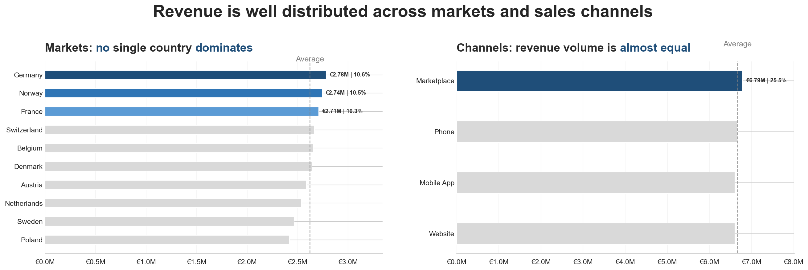

**Business interpretation:** This even distribution limits NordHome's revenue concentration risk — the business isn't heavily dependent on one country or one sales channel, which provides resilience if performance weakens in a particular market or channel. However, equal revenue contribution does not mean equal business value: channels and markets may still differ in margin, customer acquisition cost, return rate, and growth potential.

**Limitation:** Because this dataset is generated, the unusually even distribution across countries and channels may partly reflect the data generation process rather than realistic customer demand.

**Further investigation:** Compare markets and channels on revenue growth, profit margin, average order value, return/cancellation rates, and customer acquisition/retention — not just current revenue share.

---

### Q3: How much do returns, refunds, and cancellations reduce gross revenue — and how does net revenue trend year over year?

**Insight:** Order status impact is stable at around 16–17% of potential order value each year, rising gradually from 16.3% in 2021 to 17.1% in 2024 YTD. For the three complete years, the affected value held steady: approximately €1.23M in 2021, €1.30M in 2022, and €1.26M in 2023. Cancelled orders account for roughly €0.5–0.6M per year; returned and refunded order value adds another €0.7–0.8M — and cancellations are the largest individual component in every year. However, actual cash refunds (from `fact_returns.refund_amount`) total only €0.59M across the full period — a 2.4% deduction rate. The large gap between full order value of Returned/Refunded orders and actual refund amounts confirms that most returns result in only partial refunds.

**Chart:** 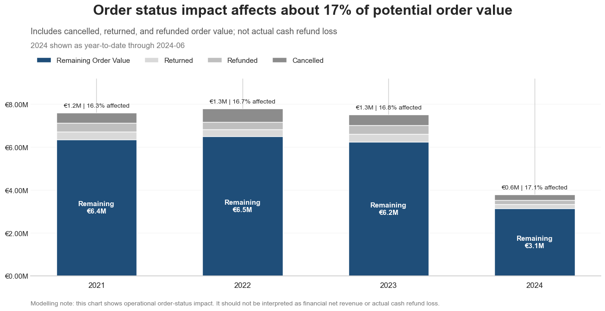

**Business interpretation:** Although the year-over-year increase is small, the affected share is moving in the wrong direction. A consistently affected rate of around 17% points to a real operational opportunity — reducing cancellations, returns, or refunds would directly increase the share of potential order value NordHome retains. Remaining order value peaked in 2022 at approximately €6.5M before declining to around €6.2M in 2023.

**Limitation:** This chart shows operational order-status impact, not actual financial loss or cash refunds — those are covered separately by the 2.4% deduction rate above. 2024 figures are year-to-date and should not be compared directly with full-year absolute values from prior years. The underlying calculation should also confirm that cancelled, returned, and refunded values are mutually exclusive to avoid double counting.

**Further investigation:** Identify which products and categories generate the most cancellations, whether certain channels or markets have higher status-impact rates, the most common return reasons, whether cancellations occur before or after fulfilment begins, and whether specific customer groups repeatedly cancel or return orders.

---

### Q4: Does NordHome have a quarterly seasonal pattern — does revenue peak at a particular time of year?

**Insight:** No stable seasonal peak exists across complete years — the strongest quarter differs by year: 2021 and 2023 both peaked in Q3, while 2022 peaked in Q2. 2022 was the strongest year overall, driven by a sharp rise from approximately €1.47M in Q1 to €1.72M in Q2 — the highest single quarter across the dataset — and revenue held up through Q4 (~€1.68M). In 2023, revenue increased gradually from Q1 to Q3 before declining in Q4, contributing to its lower annual result compared with 2022. 2024 is excluded from seasonal comparison as it only covers Q1–Q2.

**Chart:** 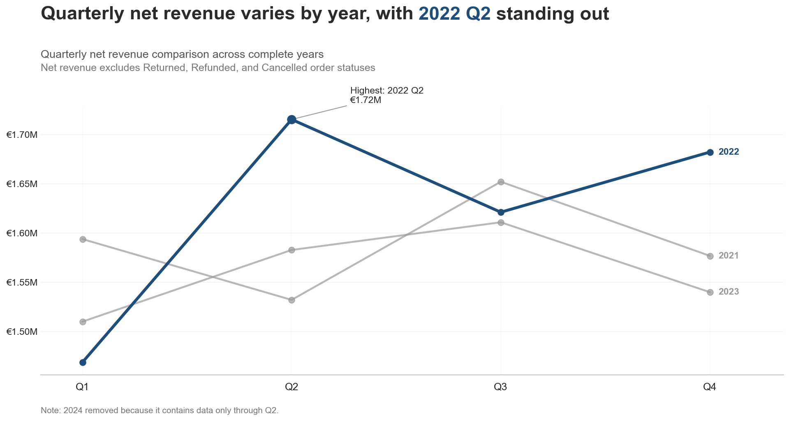

**Business interpretation:** 2022's strong year appears driven particularly by Q2 and Q4 rather than consistently higher performance across every quarter. Combined with the fact that the strongest quarter shifts from year to year (Q3 → Q2 → Q3), there isn't yet enough evidence to conclude NordHome has a stable seasonal peak — year-to-year variation is more prominent than any consistent quarterly pattern. The differences may instead relate to campaigns, product performance, sales channels, markets, or shifts in order volume rather than genuine seasonality.

**Limitation:** Only three complete years are included, and 2024 is excluded from the comparison since it only covers Q1–Q2. This gives an initial view of quarterly behaviour, but more years would be needed to confirm genuine seasonality.

**Further investigation:** Investigate what specifically drove 2022 Q2's exceptional result — order volume and average order value, high-performing products or categories, campaign and channel performance, country-level revenue, and cancellation/return/refund rates for that quarter.

**Section summary:** NordHome's revenue base is diversified across countries and channels, and leakage from actual cash refunds is small (2.4%). The bigger opportunity sits on the order-status side: 16–17% of potential order value is lost to cancellations, returns, and refunds every year, driven mainly by cancellations, and the rate is trending slightly upward rather than improving. No stable seasonal pattern exists yet — 2022 stands out as the strongest year, but that looks driven by specific strong quarters (Q2, Q4) rather than a repeatable seasonal effect.

---

## 2. Customers

### Q1: How are NordHome's customers distributed across markets and countries?

**Key finding:** NordHome's customer base is almost uniformly spread across all 10 countries, with each accounting for roughly 9–10% of customers (Norway leads at 10.4%, Austria sits lowest at 9.4% — a spread of under 1 percentage point). At the market level, Nordics (30.3%) and DACH (29.9%) together hold just under 60% of the customer base, with Benelux (19.9%) and Other — France and Poland — (20.0%) splitting the remaining 40% evenly. No single market or country dominates.

**Chart:** 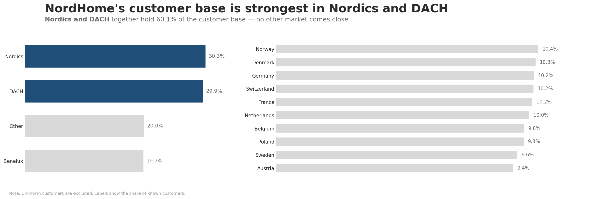

**Business interpretation:** With no country or market concentrated enough to call a stronghold, geographic expansion or retention efforts can't be prioritized by customer count alone — any market-level strategy would need to be justified by revenue, margin, or growth potential instead, not customer share.

**Further investigation:** Check whether this even customer distribution also holds for revenue, order frequency, and average order value per country — equal customer counts don't guarantee equal spending behavior.

**Limitation:** Because this dataset is generated, the near-uniform 9–10% spread across all 10 countries is unusually even for a real customer base and may reflect the data generation process rather than genuine market demand.

---

### Q2: How are NordHome's customers distributed across age groups?

**Key finding:** The age mix is remarkably balanced across adults under 70, with each group accounting for 17–20% of known customers (18–29 leads at 19.7%, 40–49 sits lowest at 17.3%). The only clear drop-off is the 70+ group at 9.0% — roughly half the share of any other cohort. Under-18 and unknown age groups are excluded. NordHome's customer base has no dominant age segment among working-age adults.

**Chart:** 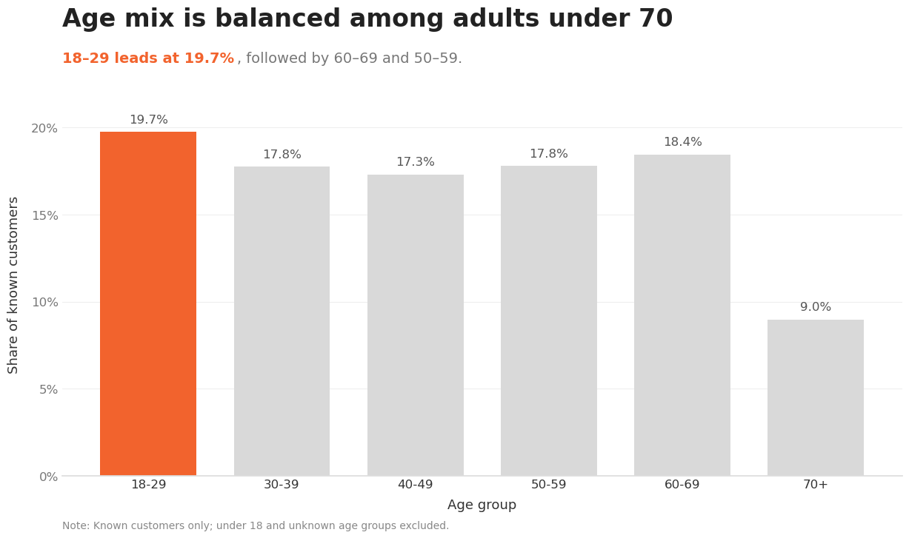

**Business interpretation:** With no dominant working-age segment, broad age-based marketing won't isolate a meaningfully larger "core" audience — behavioral segments (order frequency, category preference, loyalty status) are more likely to reveal real differences than age group alone. The 70+ drop-off is the one pattern worth taking at face value, since lower e-commerce adoption among older shoppers is a plausible, common retail pattern rather than a suspiciously even split.

**Further investigation:** Combine demographic and geographic dimensions with purchasing behavior — order frequency, average order value, total revenue contribution, product category preference, basket size, discount usage, return behavior, and loyalty membership — to identify more meaningful customer segments.

**Limitation:** Because this dataset is generated, the tightly even 17–20% split across age bands under 70 may partly reflect the data generation process rather than a real demographic pattern.

---

### Q3: Which age group has the highest average revenue per customer?

**Key finding:** The 30–39 age group has the highest average revenue per customer at €2,949, compared with €2,700 for the lowest group (18–29). The spread across all six age groups is under 10% (8.5 percentage points), so age alone is not a strong differentiator of customer value — every group sits in a fairly narrow €2,700–€2,950 band.

**Chart:** 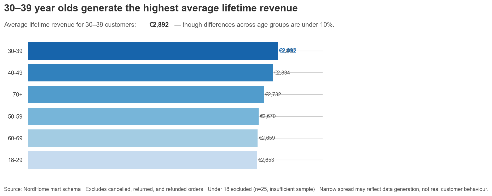

**Business interpretation:** Since the spread is narrow, age alone isn't a strong lever for targeting high-value customers — a broad age-based VIP or retention program would likely misallocate effort. Any genuinely high-value segment is more likely defined by a combination of attributes (age, loyalty status, order frequency) than by age in isolation.

**Further investigation:** Combine age group with other dimensions (loyalty status, order frequency, country) to check whether age becomes a stronger differentiator once customers are segmented further.

**Limitation:** Because this dataset is generated, the narrow, fairly even spread across age groups may reflect the data generation process rather than a real customer behaviour pattern.

### Q4: Do loyalty programme members place more orders and spend more per order than non-members?

**Key finding:** The loyalty group does not show a clear advantage in total revenue, average order value, or median order value. Loyalty members and non-members generate nearly identical revenue (€13.03M vs €13.18M) and average order value (€1,141 vs €1,137). This suggests that loyalty membership does not meaningfully change order-level spending — loyalty members do not appear to place larger baskets than non-members. The fact that average order value is considerably higher than median order value in both groups also points to a right-skewed distribution: most orders cluster near the median, while a small number of high-value orders pull the average upward.

**Chart:** 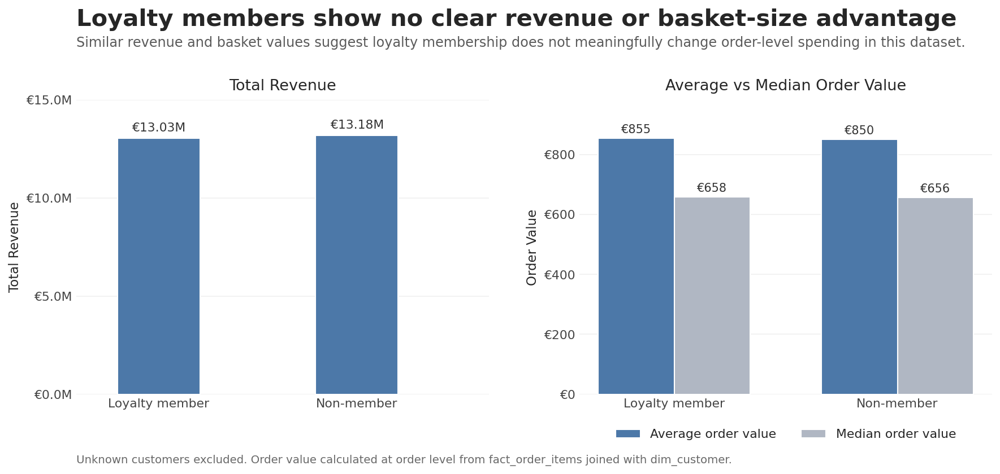

**Business interpretation:** Loyalty membership may not be effective at increasing basket size. However, this does not mean the loyalty programme has no value — its impact may appear in other customer behaviours, such as repeat purchase frequency, retention, churn reduction, or customer lifetime value, none of which this chart measures.

**Further investigation:** Investigate whether loyalty members purchase more frequently, stay active longer, or have higher customer lifetime value compared with non-members.

**Limitation:** This comparison assumes the two groups are otherwise similar in size — worth confirming against the customer and order counts now shown on the updated chart before ruling out a spending difference entirely.

---

### Q5: What share of customers bought more than once, and how much more do repeat buyers spend on average compared to one-time buyers?

**Key finding:** Repeat buyers dominate the customer base — 6,789 customers (85.2%) placed more than one order, versus 1,181 one-time buyers (14.8%). Repeat buyers also generate far more value per customer: €3,117 on average across 3.62 orders, compared to €901 for one-time buyers — a 3.5× difference. Most of NordHome's revenue is driven by customers who return, not by single-purchase acquisition.

**Chart:** 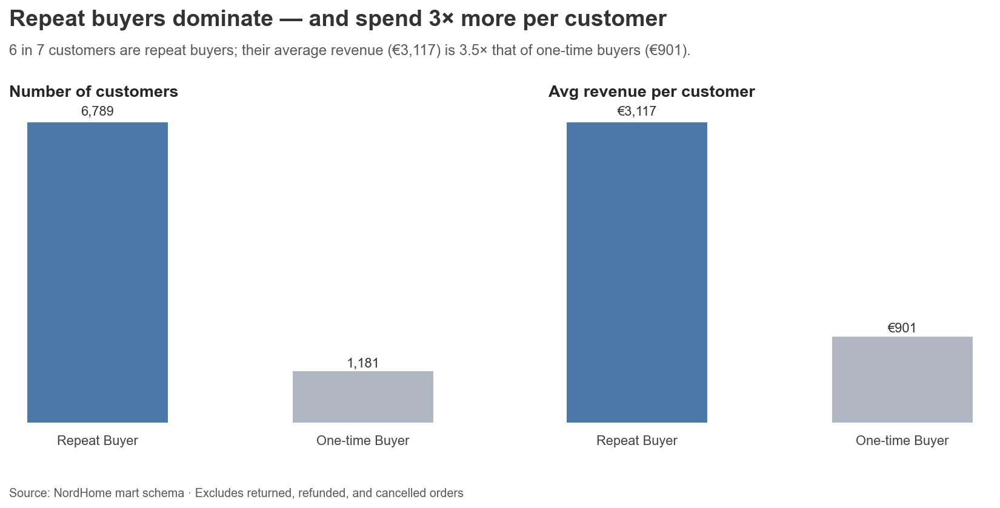

**Business interpretation:** Retention, not acquisition, looks like the primary revenue engine here — converting one-time buyers into repeat customers is likely a higher-ROI lever than pure top-of-funnel acquisition spend, since repeat buyers already generate 3.5× the value per customer.

**Further investigation:** Look at the time gap between first and second orders to separate genuine repeat behaviour from orders placed close together (e.g. split orders).

**Limitation:** This only measures order count and total spend, not the time between orders — a customer who places two orders in the same week counts as a "repeat buyer" the same as one who returns over years.

---

### Q6: How is total revenue per customer distributed, and which customers fall outside the typical range?

**Key finding:** Revenue per customer is heavily right-skewed. The typical range (Q1–Q3) runs from €1,228 to €3,537, but 267 customers — 3.4% of the 7,969-customer base — spend beyond the IQR-based upper bound of €7,000, including 118 who extend past €12,000, up to a maximum of €30,568.

**Chart:** 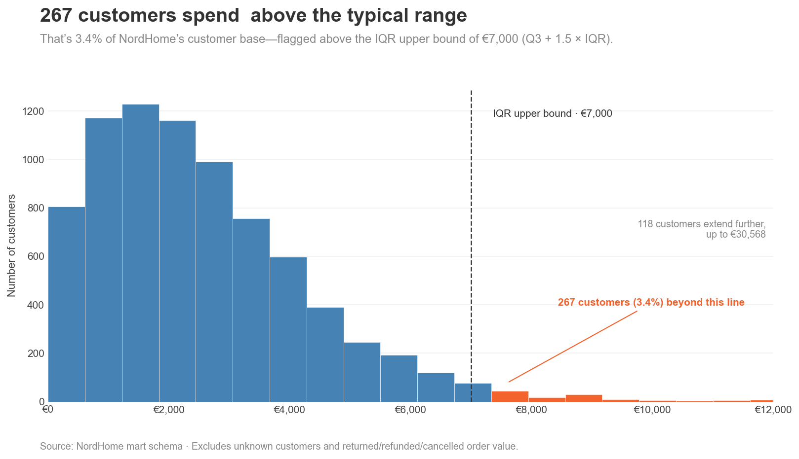

**Business interpretation:** A small group of high-spending customers sits well outside the typical range — this is worth treating as its own segment rather than folding into an "average customer" view. It connects to two earlier findings that relied on averages: Q4 showed average order value sitting well above median order value in both loyalty groups, a right-skew signature that matches what this full distribution confirms directly at the whole-customer-base level. It's also a reason to treat Q3's narrow per-age-group averages with some caution — a handful of outliers concentrated in one age group could shift that group's average without reflecting a real group-level difference. These 267 customers are candidates for a dedicated high-value segment.

**Further investigation:** Profile the 267 flagged customers against dimensions already explored — market, age group, loyalty status, product category — to see whether this high-value segment overlaps with anything already found, e.g. is it concentrated in the 30–39 age group from Q3, or spread as evenly as most other dimensions in this dataset?

**Limitation:** The IQR method (1.5× above Q3) is a statistical convention, not a business definition of "high-value" — it flags anyone unusually high relative to this dataset's own distribution, not necessarily customers meeting a specific lifetime-value target. Because this dataset is generated, the flagged group's characteristics should be validated against real customer data before being used to define an actual VIP segment.

**Section summary:** Demographic and geographic dimensions — country, market, age group, and loyalty status — show almost no differentiation in customer value; NordHome's customer base is evenly spread across all of them, and average order value or revenue per customer barely moves between groups. The real differentiation is behavioral: repeat buyers (85% of customers) generate 3.5× more value per customer than one-time buyers, and within the base overall, a small group of 267 high-spending customers (3.4%) sits well outside the typical revenue range. Any real segmentation strategy should be built on purchase behavior and revenue tier, not demographics — age, country, and loyalty membership alone don't predict value in this dataset.

---

## 3. Products

### Q1: Which product categories drive the most revenue and unit sales?

**Key finding:** Gifts leads on both revenue (€4,614K) and units sold (97,312) once returned, refunded, and cancelled orders are excluded — the strongest category outright. Unlike the gross-revenue view, revenue ranking now tracks units-sold ranking almost exactly for every category (Kitchen lowest → Lifestyle → Home → Beauty → Gifts highest on both). The one exception: Lifestyle and Home are virtually tied on revenue (€4,386K each, within 0.01%) despite Home selling ~6,000 more units (81,965 vs 76,295) — Lifestyle's ~7% higher revenue per unit (€57.48 vs €53.51) closes the gap. Revenue per unit ranges from €47.41 (Gifts) to €58.08 (Kitchen); Kitchen sits at the bottom on both revenue and units sold despite having the highest revenue-per-unit of any category.

**Chart:** 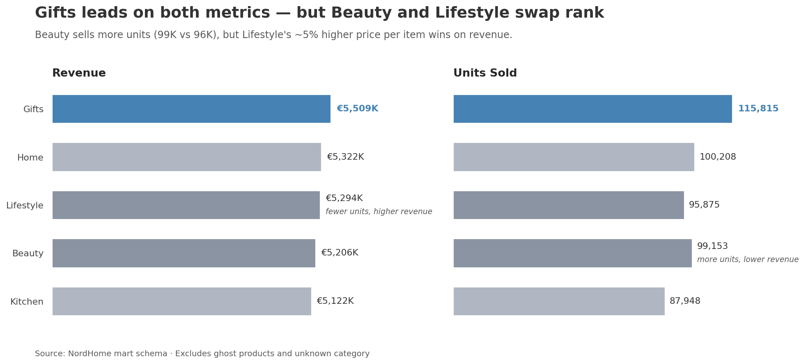

**Business interpretation:** Gifts wins on genuine demand — highest revenue AND highest volume — not on a favorable price mix. Kitchen is still the concerning one: the highest price per unit across all categories isn't translating into revenue, since it also has the lowest unit volume and lowest total revenue, suggesting it may be price-sensitive or under-marketed relative to its price point. Lifestyle's near-tie with Home on revenue despite meaningfully lower volume is the one place price power still visibly offsets weaker demand — worth watching as a smaller-scale version of the Kitchen pattern rather than a strength.

**Further investigation:** Break down Kitchen's revenue and units at the product level (see Q2) to check whether its low volume is spread evenly across the category or concentrated in a few underperforming products — that would clarify whether the issue is category-wide pricing or a handful of weak SKUs dragging the average down.

**Limitation:** This category-level view assumes a reasonably uniform product mix within each category — a category's average revenue-per-unit could be skewed by one or two outlier-priced products rather than reflecting the category as a whole (see Q2 for product-level detail). Note this chart now excludes Returned/Refunded/Cancelled order lines (an earlier version of this query did not) — the revenue figures here are net of order status and are not directly comparable to any earlier gross-revenue figures reported elsewhere in this document.

---

### Q2: Which individual products are the top 10 revenue contributors, and which categories do they come from?

**Key finding:** Gifts products dominate the top 10 best-sellers by revenue — 6 of the top 10 products belong to the Gifts category, including the single highest earner (Gourmet Hamper XL, €154K). Beauty and Home each contribute 2 products to the top 10; Lifestyle drops out of the top 10 entirely. The top 3 products by revenue are all Gifts (Gourmet Hamper XL €154K, Candle Collection Mini €149K, Candle Collection Organic €148K), and Gifts also takes the 4th spot (Custom Phone Case Organic, €125K) before the first non-Gifts product appears (Shower Oil Organic, Beauty, €113K). The lowest of the top 10 (Detangling Brush Organic, Beauty) still earns €102K — a fairly tight band across all ten products (top is only 1.50× the tenth).

**Chart:** 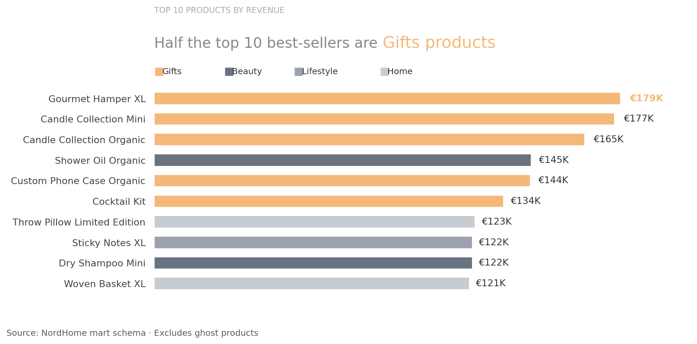

**Business interpretation:** Gifts' strength at the top of the product ranking is consistent with its category-level lead in Q1, and here it's an even stronger concentration than a straightforward category read would suggest — worth distinguishing "a few hit products" from "the whole category performs well" when deciding where to invest further. Lifestyle's absence from the top 10 despite its solid category-level revenue standing (Q1) reinforces the Q1 finding that Lifestyle's revenue comes from steadier, higher-priced-but-lower-volume sales rather than standout hits.

**Further investigation:** Compare this product-level ranking against total category revenue (not just top-10 presence) to check whether Gifts' strength here is driven by a few stand-out products or reflects genuinely stronger category-wide performance.

**Limitation:** This ranks individual products, not whole categories — Gifts' strong presence here reflects a handful of stand-out SKUs, not proof that Gifts outperforms every other category in total revenue overall. This query excludes Returned/Refunded/Cancelled order lines but does not exclude the "Unknown" product category (unlike Q1) — worth aligning the two queries' filters for full consistency.

---

### Q3: Which product categories have the highest return rate, and where is the financial (refund) impact concentrated?

**Key finding:** Kitchen has the highest item return rate at 0.98%, and Gifts ties with Kitchen for the highest total refund value (~€131K each) — despite Gifts having the *lowest* return rate of all categories (0.77%). Return rate ranges from 0.77% (Gifts) to 0.98% (Kitchen) — a narrow 0.21 percentage-point band across all 5 categories. Total refund value ranges from €121K (Home) to €131K (Gifts and Kitchen, tied within 0.18%).

**Chart:** 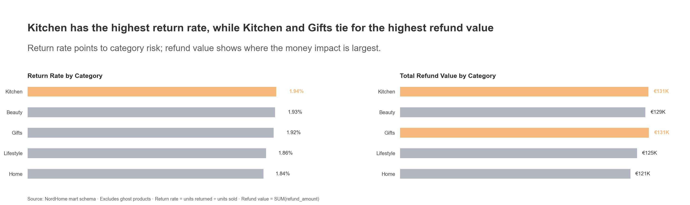

**Business interpretation:** Return rate and refund value answer different business questions — Gifts is likely higher-priced and higher-volume (confirmed in Q1), so even a below-average return rate still produces above-average refund euros. Reporting only one of these two metrics would give an incomplete, or even misleading, picture of which category carries the most return-related risk.

**Further investigation:** Compute return rate and refund value per unit returned at the product level (not just category) to check whether specific SKUs, rather than whole categories, are driving returns.

**Limitation:** All five categories sit within a narrow band on both metrics — the spread is modest relative to typical return-rate variance. Because this dataset is generated, such an evenly clustered pattern may reflect the data generation process rather than a real product-quality signal, and the 0.18% gap between Gifts and Kitchen should not be read as a meaningful ranking.

---

### Q4: How does gross margin estimated from catalog list price compare to gross margin realized from actual sales, by product category?

**Key finding:** NordHome is selling at a loss across every product category. Realized gross margin — calculated on actual transaction prices net of returns — is negative in every category, ranging from -5% (Lifestyle, Kitchen) to -30% (Beauty). The company's published/catalog pricing implies a healthy ~55% margin, but that margin is never actually being realized at the point of sale.

**Chart:** 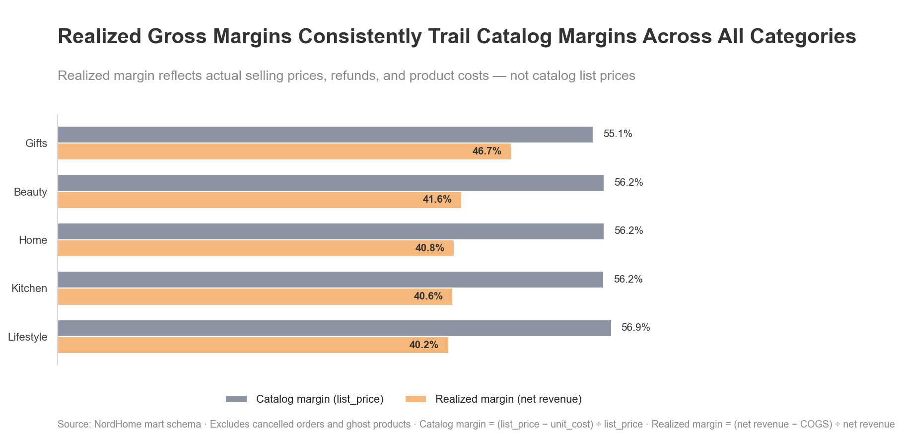

**Business interpretation:** The gap between catalog and realized margin points to systemic pricing erosion — the business is pricing products to earn 55% margin on paper, but discounting, promotions, or price overrides are pushing actual sale prices low enough that the company loses money on every unit sold, before even accounting for fixed costs. Beauty and Gifts are the most severely affected (-30% and -24%), suggesting these categories are either the most heavily discounted or the most exposed to promotional/marketing-driven price cuts. This isn't a rounding issue — a business cannot sustain negative unit economics at scale; growth in sales volume would actively accelerate losses rather than build revenue.

**Further investigation:** Audit discounting practices by category, especially Beauty and Gifts, to identify whether promotions or price overrides are the driver. Cross-reference with the marketing campaigns table — if the negative-margin categories overlap with the most heavily promoted campaigns, that's a signal campaigns are being funded by margin, not incremental profit.

**Limitation:** This assumes `unit_cost` (cost of goods) is accurate — if COGS assumptions are stale or wrong, the "loss" could be overstated; if confirmed accurate, pricing strategy needs immediate revision. This should be treated as a pricing governance issue: catalog price should not be allowed to diverge this far from realized price without an approval/reporting mechanism. There is also a VAT asymmetry between the two sides of this comparison: realized margin assumes `unit_price`/`line_total` are VAT-exclusive (a project-wide assumption, not a verified fact), while `list_price`'s VAT treatment could not be determined at all — it showed near-zero correlation with `unit_price` (r ≈ -0.001), so there's no reliable basis to confirm whether catalog margin is VAT-exclusive too. If `list_price` actually includes VAT, catalog margin is inflated and the true gap to realized margin is smaller than shown here.

**Section summary:** Gifts is the standout category — strongest on revenue, units, and product-level rankings. Kitchen is the concerning one: highest price per unit, lowest volume, lowest revenue, and the highest return rate, a combination that points to overpricing relative to demand. Return-related risk doesn't map cleanly onto revenue or return-rate rankings alone — Gifts carries the highest refund euros despite the lowest return rate, purely because of its scale. But the most urgent finding cuts across every category: realized gross margin is negative everywhere, meaning NordHome is currently losing money on every unit sold regardless of which category wins on revenue or volume — a pricing/discounting problem that needs to be resolved before category-level growth strategy matters.

---

## 4. Payments

### Q1: How much of payment value is cleanly collected, and how concentrated is revenue across payment methods?

**Insight:** Payment collection is fragmented across methods, and almost 3 in 10 euros of payment value isn't cleanly collected.

**Evidence:** Only 70.3% of total payment value lands as "Paid." The remainder is split across Pending (10.1%), Refunded (9.7%), Failed (4.9%), and Partially Refunded (5.0%) — nearly 30% of payment value sits outside a clean, completed transaction. On the method side, no single payment method dominates: Credit Card leads but only at 23.7%, with Debit Card (17.7%), Bank Transfer (17.6%), and PayPal (17.3%) essentially tied, and Klarna/BNPL (11.9%) and Apple Pay (11.8%) together accounting for close to a quarter of paid revenue.

**Chart:** 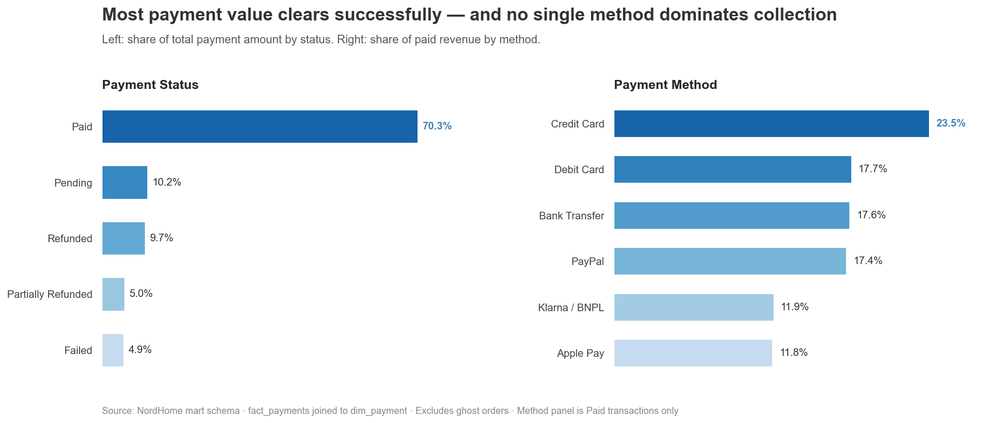

**Business interpretation:**
- Failed payments (4.9%) are the most actionable line item — this is revenue lost purely to payment friction (declined cards, timeouts, technical failures), not customer intent to not buy. It's the most direct, quantifiable case for investing in payment retry logic or failure-recovery flows.
- Pending (10.1%) is a cash-flow visibility risk, not necessarily a loss — but at this size, it's material enough that finance shouldn't treat gross order value as equivalent to collected cash when forecasting.
- Refunded + Partially Refunded (~14.7% combined) lines up with the return-rate and margin findings already surfaced above (Kitchen's high return rate, negative realized margin) — this is a third independent signal pointing at the same underlying issue: a meaningful share of revenue doesn't stick.
- The flat payment-method distribution means no method can be deprioritized. Consolidating around "the top payment method" would put roughly three-quarters of paid revenue at risk, since the top four methods are all within a similar range. This also limits negotiating leverage with any single processor, since none of them is indispensable to volume in isolation — but none is safely droppable either.

**Why this matters:** Three separate metrics (returns, margin, payments) are independently converging on the same story — a non-trivial share of revenue that looks "sold" doesn't convert into money the business actually keeps. That consistency across independently-sourced fact tables (`fact_returns`, `fact_order_items`, `fact_payments`) is itself a useful validation signal, not just a business finding — it suggests this isn't noise in one table, but a real pattern reflected across the data model.

**Recommended next step:** Quantify the overlap — are Failed and Pending payments concentrated in specific categories or payment methods (e.g., is Klarna/BNPL disproportionately represented in Failed or Pending)? If so, that narrows the fix to a specific checkout flow rather than a general payments problem.

---

### Q2: Which payment methods carry disproportionate unpaid value risk, relative to how much payment value they process?

**Insight:** Unpaid payment risk is proportional to payment value processed — no payment method is disproportionately risky.

**Chart:** 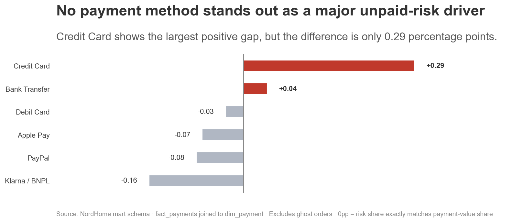

**Business interpretation:** This is a null result on the original hypothesis, and that's a meaningful finding in itself. If payment method choice were driving collection risk, at least one method would show a clear, large deviation from its payment-value share. None do — the largest gap (Credit Card, +0.29pp) is close to negligible. This rules out "payment method" as a driver of unpaid/pending value and redirects the investigation toward other explanatory factors — order value, product category, customer segment, or time-to-payment are more likely candidates than checkout method.

**Why this matters:** Three prior findings (return rate/refund value by category, realized margin, payment status breakdown) all pointed to real, category- or product-level patterns. This analysis shows that not every dimension produces a meaningful pattern — payment method genuinely doesn't. Reporting this negative result alongside the positive ones demonstrates the analysis is following the evidence rather than searching for a story, and it correctly narrows where further investigation should focus.

**Recommended next step:** Re-run the same proportional-deviation logic segmented by order value tier or product category instead of payment method — if unpaid risk concentrates by category (e.g., higher in Kitchen, consistent with its already-elevated return rate) or by order size, that's a stronger and more actionable lead than payment method was.

**Section summary:** Payment collection, not payment method, is where the risk sits. Nearly 30% of payment value never reaches a clean "Paid" state — split across Pending (10.1%), Refunded (9.7%), Partially Refunded (5.0%), and Failed (4.9%) — and Failed is the clearest lever since it reflects payment friction, not lost customer intent. Payment method choice is not the driver of this risk: unpaid value is proportional to payment volume for every method, with the largest deviation (Credit Card) only +0.29pp. Combined with the returns and margin findings from earlier sections, this is a third independent signal that a meaningful share of "sold" revenue doesn't convert into collected cash — and the fix belongs in checkout/collection processes and order-level segmentation (value tier, category, time-to-payment), not in favoring one payment method over another.

---

## 5. Returns

### Q1: Which product categories are returned most often, and what reasons drive the most returns?

**Insight:** Return volume is nearly identical across product categories, but heavily concentrated in one reason: customer preference.

**Evidence:** Returns are spread evenly across categories, from 828 (Home) to 887 (Gifts) — a 7% spread across all five categories, so no category stands out as a return-volume hotspot. Return reasons tell a different story: "Customer preference" accounts for 1,358 returns, nearly double the next most common reason (Product information mismatch, 692), while Delivery issue (679), Price issue (675), Fulfillment issue (669), Order issue (666), and Product quality (664) are all tightly clustered together, with Unknown at 634.

**Chart:** 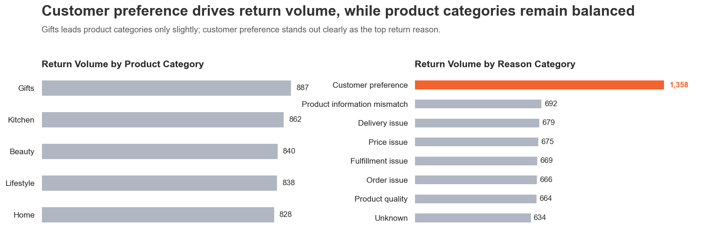

**Business interpretation:** Since category barely differentiates return *volume*, category-specific fixes (e.g. targeting Kitchen or Gifts) won't meaningfully reduce total returns — though Q3 in the Products section shows Kitchen still leads on return *rate* relative to units sold, a different metric than the raw count here. The reason breakdown is more actionable: "Customer preference" being the single largest reason, well ahead of every operational reason (delivery, fulfillment, order, quality) individually, suggests returns are driven more by expectation-setting — product description, imagery, sizing — than by operational failures.

**Further investigation:** Break down "Customer preference" returns by category and price tier — if concentrated in specific categories or higher-priced items, that points to a product-page or expectation-setting fix rather than a fulfillment or quality fix.

**Limitation:** "Customer preference" is a broad catch-all reason — it doesn't distinguish "changed my mind" from "didn't match expectations" or other sub-reasons that would each imply a different fix. The two queries behind this chart also use different filters (`ghost_product_flag` for the category panel, `ghost_order_flag` for the reason panel), so totals aren't directly comparable between the two panels — each should be read as its own independent ranking.

---

### Q2: How have item and revenue return rates trended year over year, and how does H1 2024 compare to previous years?

**Insight:** Both return rates remained relatively stable from 2021 to 2023, then increased clearly in H1 2024.

**Chart:** 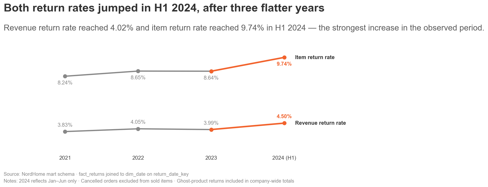

**Business interpretation:** Returns became more frequent in 2024, but the revenue impact increased more moderately than the item volume impact. The jump in H1 2024 is a potential warning signal — it may indicate changes in customer expectations, product quality, delivery experience, or product information accuracy. The chart alone does not explain the cause.

Benchmarked externally, NordHome's H1 2024 item return rate (9.74%) sits slightly below the reported German online purchase return rate (~11%), and the revenue return rate (4.02%) sits below the European e-commerce returned-revenue benchmark (~7%). So the absolute level is not unusual — the concern is the *direction* of change after three stable years. Because NordHome is a mixed retail dataset rather than fashion-heavy, these external benchmarks are only rough reference points, not a like-for-like comparison.

**Limitation:** 2024 only includes January–June, so the increase should be interpreted carefully. A full-year comparison or an H1-to-H1 comparison is needed before concluding that 2024 is structurally worse than previous years. External benchmarks also come from different markets/business mixes and are only directionally useful.

**Further investigation:** Investigate which return reasons, product categories, channels, or customer segments contributed most to the 2024 increase. Compare return rates separately by category (Home, Kitchen, Beauty, Gifts, Lifestyle) to benchmark more accurately against a mixed-retail baseline.

---

### Q3: Which sales channel and which country have the highest order-level return rate, and how large are the differences?

**Insight:** Marketplace shows the highest return rate, but differences across channels are small.

**Chart:** 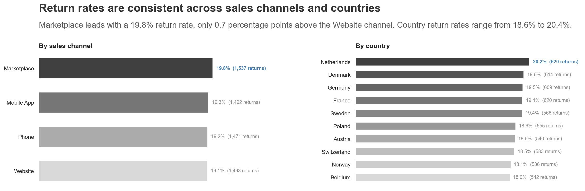

**Business interpretation:** No channel or country stands out as a clear return-risk driver — order-level return rate looks structurally consistent regardless of how or where the order was placed. This points away from channel/country as the lever for reducing returns; the driver is more likely elsewhere (product category, price point, or return reason), consistent with Kitchen already carrying the highest item return rate.

**Limitation:** Because this dataset is generated, the tight, even spread across both dimensions may reflect the data generation process rather than a genuine absence of channel/country effects.

**Further investigation:** Check whether return *reason* (not just return rate) varies by channel or country — a flat rate could still hide different underlying causes.

---

### Q4: Where specifically — which channel × country combination — do order return rates run highest, and is that variation meaningful?

**Insight:** No single channel or country drives high returns on its own; the highest rates only show up when you cross the two dimensions, and even then the spread stays fairly narrow.

**Evidence:** Across all 40 channel × country combinations, order-level return rate ranges from 16.0% to 22.8% (average 19.0%). The two highest cells are Marketplace orders in the Netherlands (22.8%, 170 of 745 orders) and Marketplace orders in Denmark (21.9%, 173 of 791 orders) — 3.8 and 2.9 percentage points above the overall average respectively, each based on roughly 750–790 orders. The lowest cell is Marketplace orders in Switzerland (16.0%, 137 of 857 orders).

**Chart:** 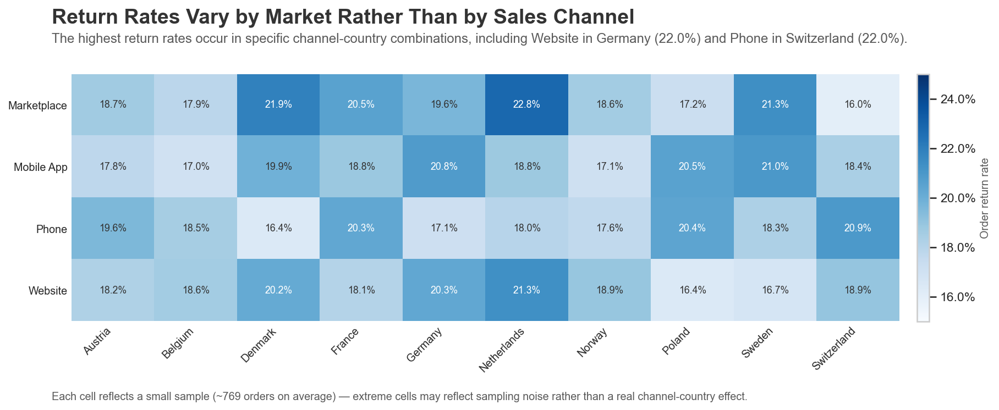

**Business interpretation:** This confirms and sharpens the Q3 finding — return rate isn't explained by channel alone or country alone, but crossing them does reveal a couple of mildly elevated cells (Marketplace × Netherlands, Marketplace × Denmark). A roughly 6.8-percentage-point range across 40 combinations, each with several hundred orders, is a modest spread — worth a note, not yet a strong enough signal to justify channel- or country-specific return policy changes on its own.

**Further investigation:** Check whether Marketplace × Netherlands and Marketplace × Denmark stay elevated when re-cut by return reason or product category — if the elevated cells are driven by the same "Customer preference" pattern seen in Q1, that's a weaker, less actionable signal than if a specific operational reason (delivery, fulfillment) concentrates there.

**Limitation:** With ~40 combinations and roughly 700–860 orders each, the two highest cells could plausibly reflect sampling noise rather than a genuine channel-country effect — a formal significance check (e.g. comparing each cell's return rate against the overall average with a proportion test) would be needed before treating this as a real pattern rather than normal variation.

---

**Section summary:** Return rates held steady for three years (2021–2023: ~8.2–8.7% of items, ~3.5–3.7% of revenue) before rising in H1 2024 (9.74% items, 4.02% revenue) — a real shift, though still within external benchmark ranges. Neither category, channel, nor country explains the pattern on its own: return volume is nearly flat across product categories (Q1), return rate is nearly flat across sales channels (19.1–19.8%) and countries (18.0–20.2%) (Q3), and even crossing channel with country only turns up a modest 16.0–22.8% range (Q4). The one dimension that does differentiate clearly is return *reason* — "Customer preference" accounts for far more returns than any operational cause (Q1), consistent with Kitchen's already-elevated item return rate from the Products section. Together, this points the 2024 investigation toward product-level and reason-level drivers — product descriptions, imagery, expectation-setting — rather than channel, country, or geography.

---

## 6. Marketing

### Q1: Which marketing channels generate the most clicks and conversions, and which channel converts at the highest rate?

**Insight:** Paid Social converts best, but the gap between the strongest and weakest channel is narrow.

**Evidence:** Paid Social leads at 22.4% conversion (111 of 496 clicks), followed closely by SMS (21.2%), Push Notification (20.9%), Display (19.9%), Influencer (19.8%), and Email (19.6%). Affiliate trails at 18.1% (96 of 531 clicks) — the full range across all seven channels is only 4.3 percentage points.

**Chart:** 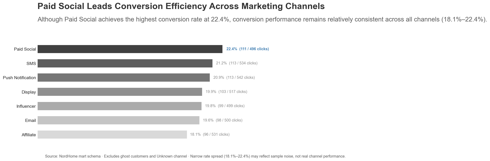

**Business interpretation:** No channel stands out as dramatically better or worse — a 4.3pp spread across roughly 500–540 clicks per channel is a small, possibly noisy gap rather than a decisive performance signal. Paid Social is the nominal leader, but treating this as a clear case for reallocating budget would be premature given how close every channel sits to the 18–22% band.

**Further investigation:** Segment conversion rate by individual campaign within each channel (see Q2) — a channel-level average can mask a few standout or weak campaigns underneath it.

**Limitation:** With 496–542 clicks per channel, a handful of additional conversions could shift the ranking — this should be read as directional, not a confirmed ranking, without a larger sample or a formal significance test.

---

### Q2: Which campaigns are most effective at converting customers, and which marketing channels drive this performance?

**Insight:** The top-converting campaigns cluster around seasonal/promotional moments (Spring Refresh, Black Friday, Summer Sale) rather than any single channel.

**Evidence:** Of the top 10 campaigns by conversion rate (filtered to campaigns with 30+ clicks), Spring Refresh 2022 and Spring Refresh 2024 tie for first at 38.24% — both via Push Notification, with identical volumes (34 clicks, 13 conversions). Black Friday 2022 (SMS) follows at 37.5%. Channels are mixed across the remaining top 10: Push Notification, SMS, Paid Social, Affiliate, Influencer, and Display all appear at least once.

**Chart:** 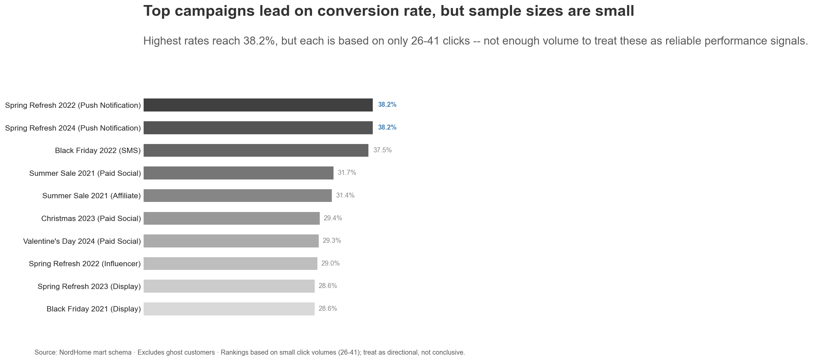

**Business interpretation:** The top campaigns aren't concentrated in one channel — Q1's channel-level ranking (Paid Social leading) doesn't hold once you look at individual campaigns; Paid Social appears twice in the top 10, but so do several other channels. This suggests campaign design and targeting matter more than channel choice alone. That two campaigns two years apart (Spring Refresh 2022, Spring Refresh 2024) return an identical click and conversion count (34/13) is unusual and worth flagging rather than treating as a repeatable seasonal effect.

**Further investigation:** Check whether seasonal campaign types (Spring Refresh, Black Friday, Summer Sale) systematically outperform always-on/non-seasonal campaigns across the full campaign list, not just this top-10 cut.

**Limitation:** All top 10 campaigns have small click volumes (31–42), close to the >30-click filter threshold — conversion rates from samples this small are noisy, and the exact duplicate result (Spring Refresh 2022 vs. 2024) suggests this may reflect the synthetic data generation process rather than a genuine, repeatable campaign effect.

---

### Q3: Which marketing channels convert loyalty members more effectively than non-members, and where should NordHome tailor its targeting strategy?

**Insight:** Loyalty members convert better through direct, opt-in channels (Push Notification, SMS, Influencer); non-members convert better through Email.

**Evidence:** Loyalty members show meaningfully higher conversion on Push Notification (22.6% vs. 19.0%, +3.6pp), SMS (22.9% vs. 19.5%, +3.4pp), and Influencer (20.9% vs. 18.8%, +2.1pp). Non-members convert better on Email (20.6% vs. 18.7% for loyalty members — a 1.9pp gap in the opposite direction). Paid Social, Display, and Affiliate show only small gaps (within 0.4pp) either way.

**Chart:** 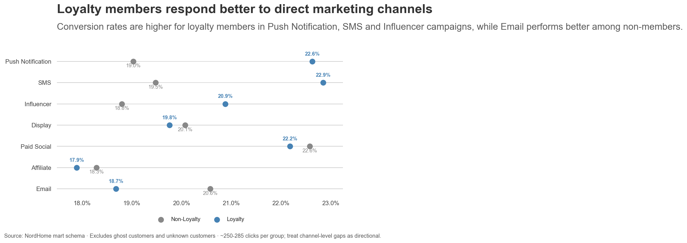

**Business interpretation:** This is a more targeted, actionable version of Q1/Q2 — rather than picking one "best" channel overall, NordHome could route loyalty members toward Push Notification and SMS (channels that already require an opt-in relationship, consistent with a loyalty member's existing engagement) and prioritize Email for reaching non-members, instead of applying one channel strategy across all customers.

**Further investigation:** Test whether this pattern holds at the campaign level (cross with Q2) — are loyalty members specifically driving the Push Notification top-campaign results seen in Q2 (Spring Refresh 2022/2024)?

**Limitation:** Each channel × loyalty-status combination has a consistent ~250–285 clicks, which makes this comparison more reliable than Q2's — but the gaps (2–4pp) are still modest enough to treat as directional rather than confirmed, until re-tested on more data or over a longer period.

---

**Section summary:** Channel-level conversion differences are narrow on their own (Q1: a 4.3pp range across all seven channels), and the strongest campaigns don't concentrate in one channel either (Q2: top 10 spans six different channels). The clearest, most actionable pattern only appears once you segment by audience: loyalty members convert better through direct, opt-in channels (Push Notification, SMS, Influencer), while non-members respond better to Email (Q3). This reframes the original question from "which channel is best" to "which channel is best for which audience" — NordHome's targeting strategy should split by loyalty status rather than lead with a single company-wide channel priority.

---

## Open Questions

Questions raised during EDA that need deeper investigation in the analysis folders, ordered by business severity (most severe first).

1. **Verify `unit_cost` accuracy and resolve the `list_price` VAT treatment** (Products Q4) — the "NordHome loses money on every unit sold" finding depends on both being correct; if COGS is stale or `list_price` turns out to include VAT, the true margin gap could be smaller, or the loss claim could be wrong entirely.
2. **Audit discounting practices by category, especially Beauty and Gifts, and cross-reference against marketing campaigns** (Products Q4) — needed to identify *why* realized margin is negative before any pricing fix can be proposed.
3. **Confirm cancelled, returned, and refunded order values are mutually exclusive** in the order-status impact calculation (Revenue Q3) — double-counting here would overstate the 16–17% "lost value" figure, a headline financial metric in this project.
4. **Quantify whether Failed and Pending payments concentrate in specific categories or payment methods** (Payments Q1) — turns the "nearly 30% of payment value isn't cleanly collected" finding into an actionable fix rather than a general observation.
5. **Segment unpaid payment risk by order value tier or product category** (Payments Q2) — payment method was ruled out as the driver; this is the next most likely lead.
6. **Identify which product categories, channels, or customer segments drove the H1 2024 return-rate increase** (Returns Q2 / section summary) — determines whether 2024 is a real emerging problem or a short-term blip.
7. **Break down "Customer preference" returns by category and price tier** (Returns Q1) — the dominant return reason is too broad to act on without this cut.
8. **Profile the 267 flagged high-value customers against market, age group, loyalty status, and category** (Customers Q6) — needed to confirm whether a real, targetable VIP segment exists or whether it's evenly spread like everything else.
9. **Check whether loyalty members purchase more frequently or show higher lifetime value than non-members** (Customers Q4) — basket size shows no loyalty effect, so the program's value, if any, must be justified on a different metric.
10. **Test whether the loyalty-channel conversion pattern holds at the individual campaign level** (Marketing Q3) — confirms whether Push Notification/SMS is genuinely stronger for loyalty members or just an average-level artifact.

## limitations

This dataset was generated for analysis practice. Therefore, some distributions, such as customer age groups and country distribution, may have been intentionally created or balanced during the data generation process.

As a result, demographic and geographic patterns should not be interpreted as strong evidence of real market behavior. For example, a balanced age distribution or a specific country share may reflect the design of the synthetic dataset rather than actual customer demand.

These findings are still useful for EDA because they help understand the structure of the dataset and identify potential segmentation dimensions. However, any business conclusion based on age or country distribution should be treated carefully and validated with real customer data.