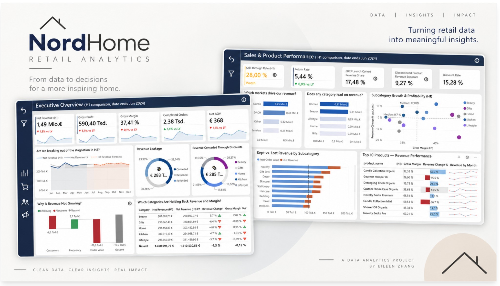
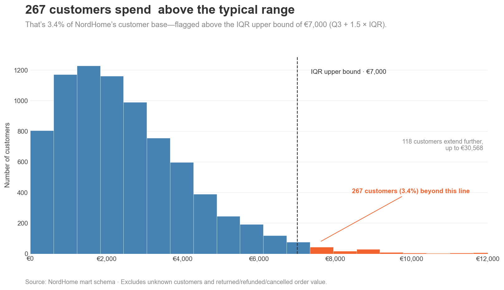
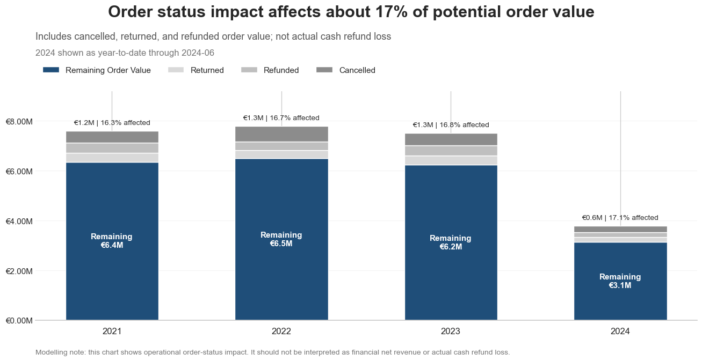
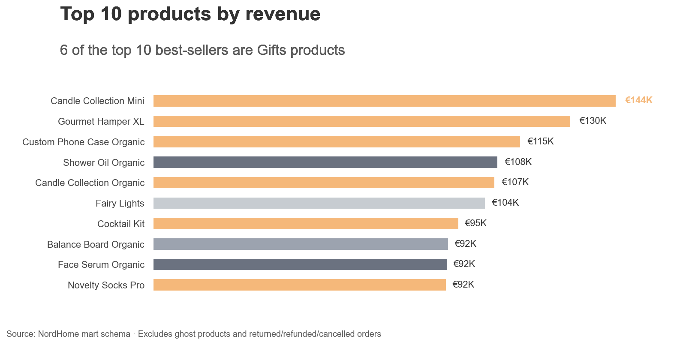
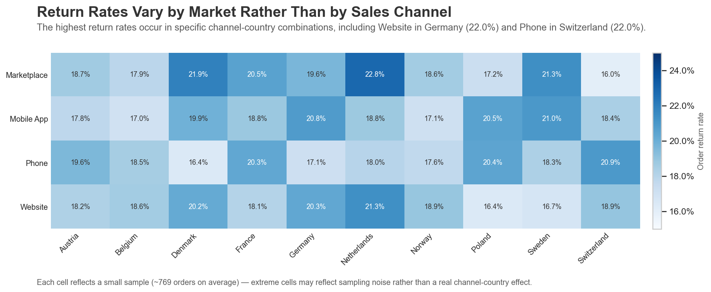
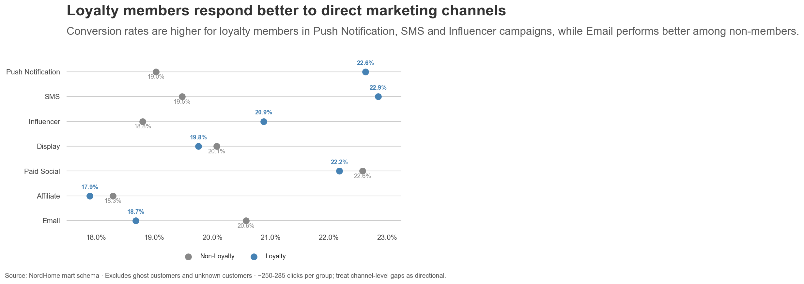

# NordHome Retail Analytics — End-to-End Portfolio Project



## Table of Contents

**Overview**
- [Project Overview](#project-overview)
- [Business Context](#business-context)
- [Project Goals](#project-goals)

**Technical Stack**
- [Technical Stack Architecture](#technical-stack-architecture)
- [Project Structure](#project-structure)

**Data Pipeline**
- [Data & Dataset](#data--dataset)
- [Data Pipeline & Architecture](#data-pipeline--architecture)
- [Data Cleaning & Quality](#data-cleaning--quality)
- [Data Modelling](#data-modelling)

**Exploratory Data Analysis**
- [Exploratory Data Analysis](#exploratory-data-analysis)

**Power BI Dashboard & Analysis**
- [Power BI Dashboard](#power-bi-dashboard)
  - [1. Executive Overview](#1-executive-overview)
  - [2. Sales & Product Performance](#2-sales--product-performance)
  - [3. Customer Analysis](#3-customer-analysis)
  - [4. Marketing Analysis](#4-marketing-analysis)
- [Key Business Insights](#key-business-insights)
- [Recommendations for H2](#recommendations-for-h2)

**Wrap-up**
- [Challenges & Decisions](#challenges--decisions)
- [What I Learned](#what-i-learned)
- [Future Improvements](#future-improvements)
- [Disclaimer](#disclaimer)
- [How to Reproduce This Project](#how-to-reproduce-this-project)

---

## Project Overview

NordHome is a fictional pan-European online retailer. This project takes intentionally dirty synthetic data, cleans and models it in PostgreSQL, and delivers a star schema data mart, exploratory analysis, and a published Power BI dashboard — a full analytics engineering workflow from raw CSV to executive reporting.

**[📊 See the Power BI Dashboard](#power-bi-dashboard)** — screenshots of all four pages, since the report itself isn't published to the public web (see that section for why).

See [Disclaimer](#disclaimer) before treating any number in this repo as a single source of truth.

---

## Business Context

**NordHome** sells home décor, kitchen essentials, beauty products, lifestyle goods, and curated gift sets. Founded in 2018, NordHome operates across ten European markets:

| Market | Countries |
|--------|-----------|
| DACH | Germany, Austria, Switzerland |
| Nordics | Sweden, Denmark, Norway |
| Benelux | Netherlands, Belgium |
| Other | France, Poland |

Customers discover NordHome through a mix of paid and organic marketing channels. Orders are placed via the main website, a mobile app, third-party marketplaces, and telephone, and ship via Standard, Express, Next-Day, Click & Collect, and Free Shipping tiers.

The dataset and dashboard cover **January 2021 through June 2024 (H1)** — 2024 is a half-year only, so any comparison spanning it uses H1-over-H1 (e.g. H1 2024 vs. H1 2023), never a naive full-year read.

The business tracks (as reported on the published dashboard, H1 2024 vs. H1 2023):
- **Revenue growth and risk** — Net Revenue, Gross Margin, and a Revenue Leakage waterfall showing how much is lost to cancellations, returns, and refunds, benchmarked against a 10–15% healthy range for the sector
- **Sales and product performance** — revenue by category and subcategory, discount impact, sell-through rate, and revenue exposure from discontinued or newly launched products
- **Customer behavior** — repeat purchase rate, new vs. churned customers, loyalty membership's actual effect on revenue, and revenue per customer by market and age group
- **Return and refund risk** — return rate, refund rate, cancellation rate, and which shipping methods and subcategories drive the most refund revenue
- **Forward-looking outlook** — an H2 revenue forecast benchmarked against the same period last year

---

## Project Goals

This is both a technical portfolio piece and a learning project. The goals were to:

1. Build a realistic analytics workflow end to end — raw CSV → cleaning → modelling → validation → EDA → dashboard — not just one isolated piece of it.
2. Practice deliberate SQL data cleaning against a dataset with intentional, non-obvious data quality issues, and document *why* each one was handled the way it was.
3. Design a Kimball star schema and be able to justify grain, key, and fact/dimension choices, not just implement a schema that happens to work.
4. Turn exploratory analysis into business questions, findings, and recommendations — not a folder of unexplained charts.
5. Ship a real, published Power BI dashboard built on that model, not a mockup.
6. Keep every non-obvious decision (a metric definition, a column exclusion, a data quality call) visible and documented, so the reasoning survives even after the numbers change.

---

## Technical Stack Architecture

```
┌────────────────────────────────────────┐
│             PostgreSQL 15              │
│      Raw → Staging → Mart layers       │
│       and analytical data model        │
└────────────────────────────────────────┘
                     ↓
┌────────────────────────────────────────┐
│                 Python                 │
│         Dataset generation and         │
│          exploratory analysis          │
└────────────────────────────────────────┘
                     ↓
┌────────────────────────────────────────┐
│             Pandas / NumPy             │
│   Data manipulation and preparation    │
└────────────────────────────────────────┘
                     ↓
┌────────────────────────────────────────┐
│               Matplotlib               │
│       Exploratory visualisation        │
└────────────────────────────────────────┘
                     ↓
┌────────────────────────────────────────┐
│            Jupyter Notebook            │
│       Exploratory data analysis        │
└────────────────────────────────────────┘
                     ↓
┌────────────────────────────────────────┐     ┌─────────────────────────┐
│            Power BI Desktop            │     │           DAX           │
│     Semantic model, DAX measures,      │ ──► │   KPI definitions and   │
│       and dashboard development        │     │ analytical calculations │
└────────────────────────────────────────┘     └─────────────────────────┘
                     ↓
┌────────────────────────────────────────┐
│            Power BI Service            │
│          Dashboard publishing          │
└────────────────────────────────────────┘
                     ↓
┌────────────────────────────────────────┐
│              Git / GitHub              │
│            Version control             │
└────────────────────────────────────────┘
                     ↓
┌────────────────────────────────────────┐
│               AI / LLMs                │
│ Custom skills, development assistance, │
│  visual ideation and iterative design  │
└────────────────────────────────────────┘
```

**Claude Code** was used throughout to optimize the workflow — automating repetitive SQL/documentation patterns via custom project skills and slash commands (`.claude/skills/`, `.claude/commands/`), reviewing code and catching data-quality bugs, and speeding up iteration on chart styling, README structure, and cross-file consistency checks. See [Disclaimer](#disclaimer) for the full scope of AI involvement.

---

## Project Structure

```
nordhome_retail_analytics/
├── 01_data_preparation/
│   ├── create_raw_tables.sql          ← raw schema DDL
│   ├── data_quality_checks.sql        ← initial profiling queries
│   ├── data_quality_findings.md       ← findings from raw data inspection
│   └── data_cleaning_decisions.md     ← documented cleaning decisions
│
├── 02_data_cleaning_transformation/
│   ├── stg_customer.sql
│   ├── stg_orders.sql
│   ├── stg_order_items.sql
│   ├── stg_payment.sql
│   ├── stg_product.sql
│   ├── stg_returns.sql
│   ├── stg_marketing_campaigns.sql
│   └── data_validation.md             ← validation checks and results
│
├── 03_data_modeling/
│   ├── 01_dimension_tables/           ← dim_customer, dim_product, dim_date, etc.
│   ├── 02_fact_tables/                ← fact_order_items, fact_payments, etc.
│   ├── model_documentation.md         ← full schema design decisions
│   └── model_validation.md            ← row counts and integrity checks
│
├── 04_EDA/                            ← completed: Revenue, Customers, Products,
│   │                                     Payments, Returns, Marketing
│   ├── nordhome_eda.ipynb
│   ├── base_style.py                  ← shared chart style
│   ├── figures/                       ← 25 exported charts
│   └── insights.md
│
├── 05_Power BI/
│   ├── export_mart_to_csv.sql         ← mart → CSV export (boolean-safe casts)
│   ├── mart_export/                   ← exported CSVs (not committed)
│   ├── dax_measures.md                ← current DAX measure reference
│   ├── decisions_log.md               ← current modelling/design decisions
│   └── archive/                       ← superseded drafts, kept as history
│       ├── power_bi_modelling_decisions.md
│       └── dashboard_design.md
│
├── data/
│   ├── raw/                           ← generated CSVs (not committed)
│   └── cleaned/                       ← cleaned exports (not committed)
│
├── docs/
│   ├── DATA_DICTIONARY.md
│   ├── DATA_PIPELINE.md
│   ├── MART_SCHEMA_REFERENCE.md
│   └── business_rules/
│       ├── BUSINESS_METADATA.md
│       └── revenue_deduction_logic.md
│
├── scripts/
│   └── generate_retail_dataset.py     ← synthetic dataset generator
│
└── validation/
    └── data_quality_issues.md
```

---

## Data & Dataset

| File | Table | Rows | Notes |
|------|-------|------|-------|
| `raw_customers.csv` | Customers | 8,364 | Includes duplicates & dirty fields |
| `raw_products.csv` | Products | 1,090 | Includes discontinued items |
| `raw_orders.csv` | Orders | 31,465 | Jan 2021 – Jun 2024 |
| `raw_order_items.csv` | Order Items | 75,473 | Line-level detail |
| `raw_payments.csv` | Payments | 31,936 | One payment per order |
| `raw_returns.csv` | Returns | 6,097 | ~8% of items |
| `raw_marketing_campaigns.csv` | Campaigns | 12,000 | 14 campaign touchpoints |

**Total: ~166,000 rows** — all intentionally dirty for SQL cleaning practice. Row counts verified live against Postgres.

> The `data/raw/` and `data/cleaned/` folders are excluded from version control. Run the generator script (see [How to Reproduce This Project](#how-to-reproduce-this-project)) to populate them locally.

> **Dataset limitation — distributions:** This dataset is synthetically generated.
> Distributions across segments (age groups, countries, sales channels, customer types) tend to be more balanced than real retail data.
> Differences between groups are often small (< 10%) and may reflect the generator's parameters rather than genuine customer behaviour.
> Treat cross-segment comparisons as directional, not conclusive.

---

## Data Pipeline & Architecture

```
scripts/generate_retail_dataset.py   ← synthetic raw CSVs
         ↓
01_data_preparation/                 ← raw schema DDL + data quality findings
         ↓
02_data_cleaning_transformation/     ← staging layer (stg schema, 7 SQL files)
         ↓
validation/                          ← automated SQL assertions and quality checks
         ↓
03_data_modeling/                    ← star schema (6 dimensions, 4 fact tables)
         ↓
04_EDA/                              ← Python EDA — revenue, customers, products,
                                        payments, returns, marketing (insights.md)
         ↓
05_Power BI/                             ← mart export, DAX design, modelling decisions
         ↓
Power BI Service                     ← published, public dashboard
```

Each layer has a clear purpose:

| Layer | Purpose |
|-------|---------|
| **Raw** | Original CSV files loaded without changes |
| **Staging** | Clean, standardize, and type-convert every source table |
| **Validation** | SQL assertions for referential integrity and data quality |
| **Data mart** | Kimball star schema — fact and dimension tables for analysis |
| **Reporting** | Python EDA and the published Power BI dashboard |

---

## Data Cleaning & Quality

The project's data quality philosophy (from `CLAUDE.md`): detect the issue, count affected rows, assess business impact, then decide whether to clean, standardize, flag, map to unknown, or exclude — and document the decision. Messy rows are never silently dropped or auto-corrected.

Critical issues found in the raw layer (`01_data_preparation/data_quality_findings.md`), before any cleaning:

| Table | Rows | Critical issues found |
|---|---|---|
| `raw_customers` | 8,364 | Invalid emails, mixed date formats, inconsistent loyalty values |
| `raw_products` | 1,090 | Missing categories, text-formatted prices and dates |
| `raw_orders` | 31,465 | Duplicate `order_id`s (every one appears exactly twice), 496 ghost customer references |
| `raw_order_items` | 75,473 | 379 negative quantities, 241 zero unit prices, 299 out-of-range discounts, 452 ghost product references |
| `raw_payments` | 31,936 | 471 duplicate rows, 1,930 missing payment methods, ~18 spelling variants across 7 methods, 440 payments with no matching order |
| `raw_returns` | 6,097 | 1,835 ghost products (30.1%), 60 ghost orders, 22 negative refunds, 105 returns dated before the order |
| `raw_marketing_campaigns` | 12,000 | No critical issues found |

Every "ghost" reference (an order, product, or customer ID with no match in its dimension) was preserved and flagged, not deleted — mapped to an `unknown` surrogate key (`-1`) so the row still counts toward totals but can be excluded from segment-level analysis where a real ID is required. Full cleaning decisions: `01_data_preparation/data_cleaning_decisions.md` and `02_data_cleaning_transformation/data_validation.md`. Post-cleaning quality checks: `validation/data_quality_issues.md`.

Two deeper issues surfaced later, after the initial cleaning pass — see [Challenges & Decisions](#challenges--decisions) for how they were investigated and fixed.

---

## Data Modelling

The data mart follows a Kimball star schema with **4 fact tables** and **6 dimension tables**. All fact tables share `dim_customer` and `dim_date` as conformed dimensions. Every table's grain is stated explicitly before it's built, per this project's modelling rules — no fact table gets created without first answering "one row = what?"

**Dimension tables:**

| Table | Grain |
|-------|-------|
| `dim_customer` | One row per customer |
| `dim_product` | One row per product |
| `dim_date` | One calendar day (generated via `GENERATE_SERIES`) |
| `dim_payment` | One row per payment transaction |
| `dim_return_reason` | One row per unique return reason |
| `dim_marketing_campaigns` | One row per `campaign_name + channel` combination |

**Fact tables:**

| Table | Grain |
|-------|-------|
| `fact_order_items` | One row per order line item |
| `fact_payments` | One row per payment transaction |
| `fact_returns` | One row per return event |
| `fact_marketing_touchpoints` | One row per customer-campaign-channel touchpoint |

**Star schema:**

```
                    ┌──────────────┐              ┌──────────────┐
                    │ dim_customer │              │   dim_date   │
                    └───────┬──────┘              └───────┬──────┘
                            │      (conformed — every fact table below joins to both)
        ┌───────────────────┼───────────────────┬──────────────────────┐
        │                   │                   │                      │
┌───────▼────────┐  ┌───────▼────────┐  ┌───────▼────────┐  ┌──────────▼─────────────┐
│fact_order_items │  │ fact_payments  │  │ fact_returns   │  │fact_marketing_touchpoints│
└───────┬─────────┘  └───────┬────────┘  └──┬──────┬──────┘  └───────────┬────────────┘
        │                    │              │      │                     │
┌───────▼────────┐   ┌───────▼───────┐  ┌───▼──────▼──────────┐  ┌───────▼────────────────┐
│  dim_product    │   │  dim_payment  │  │dim_product (again)  │  │dim_marketing_campaigns │
└─────────────────┘   └───────────────┘  │dim_return_reason    │  └─────────────────────────┘
                                          └──────────────────────┘
```

This is the same relationship layout built in Power BI Desktop's Model view when the mart export was loaded — `dim_customer` and `dim_date` set as the two conformed dimensions related to all four fact tables, with `dim_product`, `dim_payment`, `dim_return_reason`, and `dim_marketing_campaigns` each relating to their one owning fact table (`dim_product` relates to both `fact_order_items` and `fact_returns`).

`customer_key = -1` and `product_key = -1` are the unknown-member rows used to preserve unmatched order lines without dropping them (see Data Cleaning & Quality above). `dim_order` was deliberately removed from the model — order attributes are denormalized directly onto the fact tables instead, since no fact table needs to join to it independently.

Key modelling decisions: [03_data_modeling/model_documentation.md](03_data_modeling/model_documentation.md). Full column-level reference: [docs/MART_SCHEMA_REFERENCE.md](docs/MART_SCHEMA_REFERENCE.md).

---

## Exploratory Data Analysis

The EDA (`04_EDA/nordhome_eda.ipynb`, Python/pandas/matplotlib) works through six business areas — Revenue, Customers, Products, Payments, Returns, and Marketing — each structured as question → chart → finding → business interpretation → limitation, with 25 exported charts in `04_EDA/figures/`.

Every chart is custom-built in Python, not default library styling — a hand-developed styling module (`04_EDA/base_style.py`) drives consistent title/subtitle layout, typography, and color across all 25 charts, instead of relying on seaborn or plotly defaults.

### Highlighted findings 

**151 customers spend above the typical range**

1.9% of the customer base (151 of 7,969) spend beyond the IQR-based upper bound of €6,790, up to a maximum of €11,428. Revenue per customer is right-skewed — a small high-value segment sits well outside the "average customer" view, and this same skew is why average order value reads higher than median order value elsewhere in this analysis.

**Order status impact affects about 17% of potential order value**

16.5–17.4% of potential order value is lost to cancellations, returns, and refunds every year — a narrow, stable band with no clear improving trend. This is operational order-status impact, not actual cash loss (the real cash-refund deduction rate is a much smaller 2.6% — see [Returns ≠ refunds](#key-business-insights)) — but cancellations are consistently the largest single component.

**Top 10 products by revenue**

6 of the top 10 best-selling products — including the top 3 — are Gifts items, led by Candle Collection Mini at €144K. That's a sharper concentration than Gifts' category-level lead alone would suggest: a handful of stand-out SKUs are carrying the category, not uniformly strong performance across every Gifts product.

**Return rates vary by market rather than by sales channel**

Neither channel alone nor country alone explains return rate — across all 40 channel × country combinations, the rate ranges from 16.0% to 22.8% (average 19.0%), with the highest cells at Marketplace × Netherlands (22.8%) and Marketplace × Denmark (21.9%). A ~6.8-percentage-point spread across combinations with several hundred orders each is a modest signal worth noting, not yet strong enough to justify a channel- or country-specific return policy on its own.

**Loyalty members respond better to direct marketing channels**

Loyalty members convert meaningfully better on Push Notification (22.6% vs. 19.0%) and SMS (22.9% vs. 19.5%); non-members convert better on Email (20.6% vs. 18.7%). The actionable read isn't "which channel is best overall" — it's routing loyalty members toward Push/SMS and prioritizing Email for non-members, instead of one channel strategy for everyone.

These five are a sample, not the full picture — more insights can be found in [04_EDA/insights.md](04_EDA/insights.md).

Full write-up, including a Summary, an Actions list (open questions ranked by severity), and ready-to-brief Business Recommendations: [04_EDA/insights.md](04_EDA/insights.md).

Dedicated deep-dives (RFM segmentation, CLV modelling, sales forecasting) were scaffolded here as `05_customer_analysis/`, `06_product_analysis/`, and `07_sales_analysis/`, but never carried past a topic-list stage — removed from this repo, with customer segmentation planned as a separate project (see [Priority Focus: Customer Segmentation (RFM)](#priority-focus-customer-segmentation-rfm) under Recommendations for H2). The customer, product, and sales questions that *were* answered live inside `04_EDA/insights.md` instead.

---

## Power BI Dashboard

> **Note:** this report isn't published to the public web — the Power BI workspace it lives in doesn't have "Publish to web" enabled, so the report link only works for someone signed into the same organization. The screenshots below are the way to actually see the dashboard.

**Purpose:** evaluate how the business performed in H1 2024 vs. H1 2023, and turn that into concrete recommendations for improving performance in H2. That comparison is the default view, but slicers (Year, Market, Category) let the viewer explore other periods and prior years' performance too.

Four pages, one shared design system. The model is a 25-table, 143-measure PBIP project — a significant rebuild since the original design (`05_Power BI/archive/dashboard_design.md`, now superseded); the standalone Return & Revenue Risk page was folded into Executive Overview's leakage/discount visuals, and a Marketing Analysis page was added.

Some fields needed for this report (e.g. Sell-Through Rate's inventory data, Marketing Analysis's CPA/CPC and Pinterest channel) didn't exist in the original dataset and had to be regenerated during report creation — see [Disclaimer](#disclaimer).

### 1. Executive Overview

**Question:** Is NordHome growing, and is that growth trustworthy?

**What this page answers:**
- Is H1 revenue tracking ahead of or behind last year, and will H2 close the gap?
- How much of gross revenue is leaking to cancellations, returns, and refunds?
- How much margin is being conceded to discounting, and in which categories?
- Is the YoY change driven by customer count, purchase frequency, or order value?
- Which categories are dragging down revenue and margin the most?


Five KPI cards (Net Revenue, Gross Profit, Gross Margin, Completed Orders, Net AOV) each carry a YoY sparkline. The main trend chart runs the full year, blending actual H1 against last year and an H2 forecast band. Two donuts break down where revenue leaks (cancelled/returned/refunded) and where margin is conceded (discount share by category). A waterfall decomposes the YoY revenue change into customer count, purchase frequency, and order value, and a table ranks categories by revenue and margin movement.

**Key analytical elements:**
- KPIs: Net Revenue (H1), Gross Profit, Gross Margin, Completed Orders, Net AOV — each vs. LY
- Revenue trend with H2 forecast overlay
- Revenue Leakage donut (Cancelled / Returned / Refunded)
- Revenue Conceded Through Discounts donut (by category)
- Revenue-driver waterfall (Customers / Frequency / Order value)
- Category-level revenue & margin table

### 2. Sales & Product Performance

**Question:** What's driving revenue, and what's dragging on it?

**What this page answers:**
- Which markets and categories lead on revenue?
- Which subcategories combine strong growth with strong margin, and which combine neither?
- Which subcategories keep the most order value vs. lose it to returns?
- Which individual products are the strongest revenue performers?


KPI cards cover Sell-Through Rate (with a Watch/Critical/Healthy status callout), Return Rate, 2023 launch-cohort revenue share, discontinued-product revenue exposure, and discount impact. Two bar charts rank markets and categories by revenue; a scatter plot positions every subcategory by margin vs. YoY growth so under- and over-performers are visible at a glance; a kept-vs-lost bar chart shows how much order value each subcategory retains after returns; and a table ranks the top 10 products by revenue and margin.

**Key analytical elements:**
- KPIs: Sell-Through Rate (H1) + status, Return Rate, 2023 Launch Cohort Revenue Share, Discontinued Product Revenue Exposure, Discount Impact
- Revenue by market and by category (bar)
- Subcategory Growth & Profitability scatter (margin × YoY growth, bubble-sized)
- Kept vs. Lost Revenue by subcategory
- Top 10 Products — Revenue Performance table

### 3. Customer Analysis

**Question:** Are we earning repeat business, or just acquiring one-time buyers?

**What this page answers:**
- How many customers do we have, and how many have we lost?
- Is the customer base growing or shrinking month over month?
- Does loyalty membership actually drive more repeat purchases?
- Does buying more often make a customer more valuable?


KPI cards cover repeat purchase rate, new customers registered, repeat customers, total customers, and net revenue per customer. A growth-trend chart tracks new vs. churned customers monthly; a retained-vs-churned bar breaks the same story down by market; a loyalty comparison checks whether members repeat-purchase more than non-members; and a combo chart shows revenue per customer rising with order frequency.

**Key analytical elements:**
- KPIs: Repeat Purchase Rate, New Customers Registered, Repeat Customers, Total Customers, Net Revenue per Customer
- Customer Growth Trend (new vs. churned, monthly)
- Retained vs. churned customers by market
- Loyalty member vs. non-member repeat-order comparison
- Customers and revenue per customer by order frequency

### 4. Marketing Analysis

**Question:** Which marketing channels and campaigns actually convert, and where should budget shift?

**What this page answers:**
- How much of the marketing funnel actually converts, and where is the biggest drop-off?
- Which channels deliver the best ROI and conversion rate for the spend?
- Do conversions concentrate around specific campaigns or seasons?


KPI cards cover revenue from converted customers, customers reached, click-through rate, conversion rate, and marketing ROI. A funnel chart shows touchpoints collapsing to clicks and then conversions; a channel table ranks CPA, CPC, ROI, and conversion rate side by side; a time series highlights conversions spiking around named campaigns (Black Friday, Christmas, Valentine's Day, etc.); and a text panel calls out the recommended actions that follow directly from the data.

**Key analytical elements:**
- KPIs: Revenue from Converted Customers, Customers Reached, CTR, Conversion Rate, Marketing ROI
- Touchpoints → Clicks → Conversions funnel
- Channel performance table (CPA, CPC, Avg Touchpoints, ROI, Conversion Rate, Click→Conv Rate, CTR)
- Conversions over time with campaign highlight bands
- Recommended Actions callout

> **Open question:** this page's channel table includes a **Pinterest** channel and cost metrics (CPA, CPC) not present in the documented `fact_marketing_touchpoints` schema or `docs/business_rules/BUSINESS_METADATA.md` — likely part of the data regenerated during dashboard design (see [Disclaimer](#disclaimer)). Worth reconciling back into the source docs if this page is kept long-term.

The **current** measure definitions are in [05_Power BI/dax_measures.md](05_Power%20BI/dax_measures.md), and the reasoning behind every non-obvious modelling and design choice — including two of this project's best data-quality catches, detailed in [Challenges & Decisions](#challenges--decisions) — is in [05_Power BI/decisions_log.md](05_Power%20BI/decisions_log.md). `05_Power BI/archive/dashboard_design.md` and `05_Power BI/archive/power_bi_modelling_decisions.md` are earlier drafts, now superseded, kept only as a historical record of how the design evolved.

> **Note:** the `.pbix` was built and refreshed in Power BI Desktop outside this repository and published to the Power BI Service (link above) — it isn't committed here; an empty placeholder that used to sit at `dashboards/nordhome_dashboard.pbix` was removed since it held no real content.

---

## Key Business Insights

Pulled directly from the published H1 2024 vs. H1 2023 report (see [Power BI Dashboard](#power-bi-dashboard) above):

- **Revenue fell because of smaller baskets, not fewer or less-frequent customers.** *(Executive Overview)* Customer count (−€9K) and frequency (+€4K) roughly offset; falling order value alone drove the −€26K (−1.7%) YoY decline.
- **One category's numbers don't add up.** *(Executive Overview)* "Unknown" shows +25.1% revenue growth against a −185.56% margin swing — far outside every other category's band. Likely a data-quality artifact ([Data Cleaning & Quality](#data-cleaning--quality)), not a real finding.
- **Customer churn is outpacing acquisition everywhere.** *(Customer Analysis)* New customers (104–140/month) trail churned customers (197–254/month) in every month and market — e.g. Nordic: 802 retained vs. 1,674 churned.
- **Loyalty membership is a coin flip, not a lever.** *(Customer Analysis)* Across 11 metrics, every member-vs-non-member gap is 1–2% — no real effect, so no loyalty-comparison visual was built (full table in [05_Power BI/decisions_log.md](05_Power%20BI/decisions_log.md)).
- **Cancellations, not refunds, are the real leak.** *(Executive Overview)* A denominator error had named refunds the largest driver (€142K). Rebuilt on one consistent base: Cancelled €115.6K > Returned €90.0K > Refunded €85.3K — refunds were overstated by ~67%.
- **Marketing budget is misallocated.** *(Marketing Analysis)* Influencer has the highest CPA (€28.21) and lowest ROI (184.9%); Display and Pinterest deliver 6–8× better ROI at a fraction of the cost.

Full detail in the [Power BI Dashboard](#power-bi-dashboard) section above. These insights come from the published report only, not the `04_EDA/` Python analysis — the two were built on different underlying datasets (see [Disclaimer](#disclaimer)) and shouldn't be cross-cited as confirming each other.

---

## Recommendations for H2

Each recommendation follows directly from one of the insights above — not a generic best-practice list.

1. **Fix order value, not acquisition or frequency.** *(→ Revenue decline insight)* H2 initiatives should target basket size — bundling, upsell prompts, minimum-order incentives — since the waterfall shows acquisition and frequency are not the problem; a campaign aimed at either would miss the actual driver of the H1 decline.
2. **Audit the "Unknown" category before acting on its numbers.** *(→ Category anomaly insight)* Resolve the ghost-product/unmatched-reference data quality issue first; don't let the −185.56% margin swing drive any pricing or assortment decision until it's confirmed real.
3. **Shift retention budget ahead of acquisition budget, starting in Nordic and DACH.** *(→ Churn insight)* These two markets show the widest retained-vs-churned gap, making them the highest-leverage place to run win-back or re-engagement campaigns in H2.
4. **Re-evaluate the loyalty program's incentive structure.** *(→ Loyalty insight)* Membership isn't converting into repeat purchases at any order-frequency level — H2 should test a redesigned incentive (e.g. tied to a second purchase) rather than continuing to fund the program as-is.
5. **Reallocate marketing spend from Influencer to Display/Pinterest.** *(→ Marketing ROI insight)* This is the report's own recommended action — Influencer's ROI (184.9%) is a fraction of Display's (1,478.5%) and Pinterest's (1,104.0%) at a higher CPA, making this the lowest-risk, highest-confidence reallocation on the list.

### Priority Focus: Customer Segmentation (RFM)

**Why this is the priority, not just a natural next step:** loyalty membership — the one customer-segmentation variable this report tested — doesn't move repeat-purchase behavior at all (Key Business Insight above). Order frequency, by contrast, shows a real, large effect: the Customer Analysis page's own chart shows revenue per customer climbing from €0.4K at 1 order to €2.1K at 5+ orders, a 5× spread. That's direct evidence an RFM-style framework (built on frequency and recency) will actually work as a targeting mechanism, unlike loyalty status.

It's also the difference between a market-level recommendation and a customer-level one. Recommendation 3 above says to prioritize retention spend in Nordic and DACH — but that's still a blanket instruction across entire markets. Without RFM segments, there's no way to tell *which* customers in those markets are actually at risk of churning versus already safe, so retention budget would still be spent broadly instead of on the customers who need it. RFM turns "spend more on retention in Nordic" into "target these specific At-Risk and Champions customers," which is the only way recommendation 3 becomes executable rather than directional.

Built on an RFM framework:

- **Recency** — how recently did a customer purchase?
- **Frequency** — how often do they purchase?
- **Monetary Value** — how much value do they generate?

This would surface actionable groups such as Champions, Loyal Customers, New Customers, High-Value Customers, At-Risk Customers, and Churned Customers — shifting the analysis from *understanding how customers behave* to *identifying which customer groups need different actions*.

---

## Challenges & Decisions

A few problems didn't show up until well after the initial cleaning pass — surfaced by questioning a number that looked wrong, not by a pre-built check:

- **Corrupted order-item quantities.** A suspiciously high AOV led to checking `quantity`, revealing 228 rows (0.3%) with values up to 1996. Root cause: the generator script computes `line_total` from the real quantity first, then separately corrupts `quantity` on some rows — so `line_total` still held the true revenue. Back-solving `line_total / (unit_price × (1 − discount))` recovered the true quantity for 216 of 228 rows; the other 11 got a clamped 1–5 estimate, flagged via the existing `line_total_mismatch_flag` rather than a new one.
- **`dim_date`'s range was silently corrupted by a downstream generation defect.** `dim_date` was originally built dynamically from `MIN`/`MAX` dates across all fact tables. A generation defect in `campaign_date` pushed that max out to 2024-12-31, even though the dataset's real design window is Jan 2021–Jun 2024 — silently breaking every `SAMEPERIODLASTYEAR`-based YoY measure. Fixed by hardcoding the spine to the dataset's actual generation window instead of trusting the fact tables' own date range.
- **`list_price` and `unit_price` turned out to be statistically independent.** Correlation testing (r ≈ −0.001 across 74,783 matched lines, gaps up to +3,000%) ruled out VAT, discount, or markup as an explanation. Rather than keep `list_price` with a caveat, it was excluded from the Power BI model entirely — the failure mode of misusing it (a margin chart that looks normal but plots noise) was judged worse than losing a narrow, not-currently-needed use case.
- **Duplicate customer identities: resolve, don't merge or drop.** 148 people (296 rows) had registered twice with the same email under different `customer_id`s, and 91% had placed real orders under both. Deleting rows would have lost real order history; merging would have broken existing foreign keys. Both keys were kept, with a `canonical_customer_key` added so customer-count metrics can de-duplicate without touching the underlying fact data.
- **`raw_orders.country` looked usable — until it was checked against `dim_customer.country`.** 89.9% of rows mismatched, and the per-customer distinct-country count matched a pure random draw almost exactly, proving the field was assigned randomly at generation time, not real geography. Removed from every fact table.
- **A mismatched denominator inverted an executive-facing ranking.** Three loss-rate measures (cancelled/returned/refunded % of revenue) had each been written at a different time against a different base — one divided by Net Revenue, one by Gross Sales Revenue. On that mix, refunds looked like the largest driver of lost revenue at €142K. Rebuilt so all three divide by the same base (Gross Order Value) with mutually-exclusive numerators, the true ranking flips: cancellations are the largest driver, refunds the smallest, and the old €142K figure was overstated by ~67%. Full derivation in [05_Power BI/decisions_log.md](05_Power%20BI/decisions_log.md) — kept as the clearest example in this project that a denominator error isn't cosmetic, it can invert the decision an executive makes.
- **Product, subcategory, channel, and brand revenue all tested uniformly random — so Pareto/concentration analysis was deliberately not built.** Top-3 subcategories capture only 28.3% of revenue (a real Pareto's top ~20% would carry ~80%); all four sales channels land within 0.34 points of exactly 25%. The measures were built, verified, and then discarded rather than shipped, because a chart with no real pattern is clutter even when the numbers are correct. `order_status`, by contrast, is genuinely weighted in the generator and is exactly where the revenue-loss analysis above landed.

---

## What I Learned

- Generated data still needs to be *verified*, not just cleaned once and trusted — three of the five issues above (`dim_date`, `list_price`, `country`) were discovered by questioning a downstream number, not by an upfront data quality check.
- A single documented metric definition is worth more than a clever one. The Gross → Net revenue framework only stayed consistent across SQL, Python, and DAX because it lived in one file (`revenue_deduction_logic.md`) that every layer was checked against — without that, the same "Net Revenue" name would quietly mean three different formulas in three different tools.
- Star schema decisions have consequences that surface much later. Removing `dim_order` early on meant Return Rate had to be built revenue-based, not order-count-based, months later, since there was no clean join left for an order-count version.
- Root-causing a data bug is more valuable than working around it. Clamping the 228 corrupted-quantity rows to a guess would have been faster than back-solving the true value from `line_total` — but it would have thrown away recoverable, exact data for 216 of them.
- Documenting the *why*, not just the *what*, is what makes a project auditable later — including this README rewrite itself, which exists because the original version had drifted from what the project had actually become.
- Knowing when *not* to ship a measure or a chart is a separate skill from being able to build one. The Pareto measures and the loyalty-split visual were both built correctly and both discarded — a correct number that reveals no real pattern is still clutter, and worse, an invitation for someone to explain noise as if it were a finding.
- Measures that will ever appear in the same visual, or ever be summed, have to be designed as a set from the start. Three loss-rate measures were each individually correct when written, and still produced an inverted, executive-facing ranking once placed side by side — because each was built against a different denominator at a different time.
- Context engineering (curating what an AI assistant can see — `CLAUDE.md`, `.claude/skills/`, structured reference docs like `decisions_log.md`) only pays off if that context stays accurate. This project hit that failure mode twice: stale file paths after renaming the `powerbi/` folder to `05_Power BI/`, and `DATA_DICTIONARY.md` pointing at a `DATA_QUALITY_ISSUES.md` that doesn't exist. Confidently wrong context is worse than no context at all — it has to be maintained like code, not written once and trusted.

---

## Future Improvements

- Customer segmentation (RFM), CLV modelling, and sales forecasting were scaffolded in this repo but removed — planned as separate, dedicated project(s) instead. See [Priority Focus: Customer Segmentation (RFM)](#priority-focus-customer-segmentation-rfm).
- Reconcile the one remaining naming mismatch: `BUSINESS_METADATA.md` calls the core revenue measure "Cash-Based Net Revenue," while the dashboard and measures library call it "Net Revenue."
- Track down where `dim_product[Inventory]` (used by the dashboard's Sell-Through Rate measure) actually comes from — it isn't in `dim_product.sql`, the generator script, or any doc, so it was likely added directly in Power BI during dashboard design and never synced back to the documented schema.
- **Reconcile two conflicting counts for the same underlying issue.** `docs/business_rules/BUSINESS_METADATA.md` documents 452 rows (0.6%) with `ghost_product_flag = TRUE`, verified live against Postgres. `05_Power BI/decisions_log.md` documents 6,575 rows (8.7%) with a `product_key` matching no `dim_product` row "not even the -1 placeholder," verified against the Power BI model. These may be different things (a broken join specific to the Power BI import vs. the Postgres-level flag) or the same issue measured two different ways — not yet resolved, and the two source docs currently contradict each other on the size of the problem.
- Add a Payments and/or Marketing page to the dashboard — both were designed-for but deliberately descoped (`05_Power BI/archive/dashboard_design.md`, "Deferred / Out of scope").
- Add dashboard screenshots to this README for viewers who can't open the live Power BI link.
- Follow up on the open questions `04_EDA/insights.md` ranks highest: what's driving the H1 2024 return-rate increase, and whether Failed/Pending payments concentrate in specific categories or payment methods.

---

## Disclaimer

This project is for portfolio/demo purposes only. NordHome is a fictional company; the dataset is synthetically generated (`scripts/generate_retail_dataset.py`, seeded for reproducibility) and contains no real customer, order, or payment data.

The generated dataset had flaws that weren't all caught at the start — see [Challenges & Decisions](#challenges--decisions) for the ones found and fixed. Some source data also had to be regenerated partway through, during Power BI report creation, because it was simply missing — a few specific KPIs (e.g. Sell-Through Rate, marketing CPA/CPC) needed fields that didn't exist in the original dataset or mart schema. As a result, some numbers between the Python EDA (`04_EDA/`) and the Power BI dashboard may not fully reconcile — treat each as reflecting the state of the data at the time it was built, not a single frozen source of truth.

This project's documentation and code review were developed with AI assistance (Claude Code, guided by the project conventions in `CLAUDE.md`); all data modelling and business logic decisions were reviewed and made by the project author.

---

## How to Reproduce This Project

**Requirements:** Python 3.8+, PostgreSQL 13+, `pip install pandas numpy`

**Step 1 — Generate the raw CSV files**
```bash
python scripts/generate_retail_dataset.py
# Output written to data/raw/
```
The generator uses `random.seed(42)` and `numpy.random.seed(42)` — output is fully reproducible.

**Step 2 — Set up PostgreSQL**
```sql
CREATE DATABASE nordhome;
CREATE SCHEMA raw;
CREATE SCHEMA stg;
CREATE SCHEMA mart;
```

**Step 3 — Load raw tables**

Run `01_data_preparation/create_raw_tables.sql`, then load the CSVs:
```sql
\COPY raw.customers FROM 'data/raw/raw_customers.csv' WITH (FORMAT csv, HEADER true);
-- Repeat for each table
```

**Step 4 — Run the staging layer**

Run each file in `02_data_cleaning_transformation/` (any order): `stg_customer.sql`, `stg_orders.sql`, `stg_order_items.sql`, `stg_payment.sql`, `stg_product.sql`, `stg_returns.sql`, `stg_marketing_campaigns.sql`.

**Step 5 — Build the data mart**

Run `dim_customer.sql` first, then `dim_customer_duplicate_resolution.sql` (it alters `dim_customer` in place), then the remaining dimension tables in any order. Fact tables must run in this order:
```
03_data_modeling/01_dimension_tables/:
  1. dim_customer.sql
  2. dim_customer_duplicate_resolution.sql
  3. dim_product.sql, dim_date.sql, dim_payment.sql,
     dim_return_reason.sql, dim_marketing_campaigns.sql  ← any order

03_data_modeling/02_fact_tables/:
  1. fact_order_items.sql
  2. fact_payments.sql
  3. fact_returns.sql
  4. fact_marketing_touchpoints.sql
```

**Step 6 — Export to Power BI**

Run `05_Power BI/export_mart_to_csv.sql` to export every mart table to CSV in `05_Power BI/mart_export/` — booleans are cast to `'true'`/`'false'` text so Power BI's type detection reads them correctly (Postgres otherwise writes `t`/`f`, which imports as Text). Load the CSVs into Power BI Desktop, mark `dim_date` as a Date Table, and build the measures in `05_Power BI/dax_measures.md`, following the reasoning in `05_Power BI/decisions_log.md`.

---

*Dataset generated with Python · pandas · numpy · Seed 42 · NordHome is entirely fictional.*
